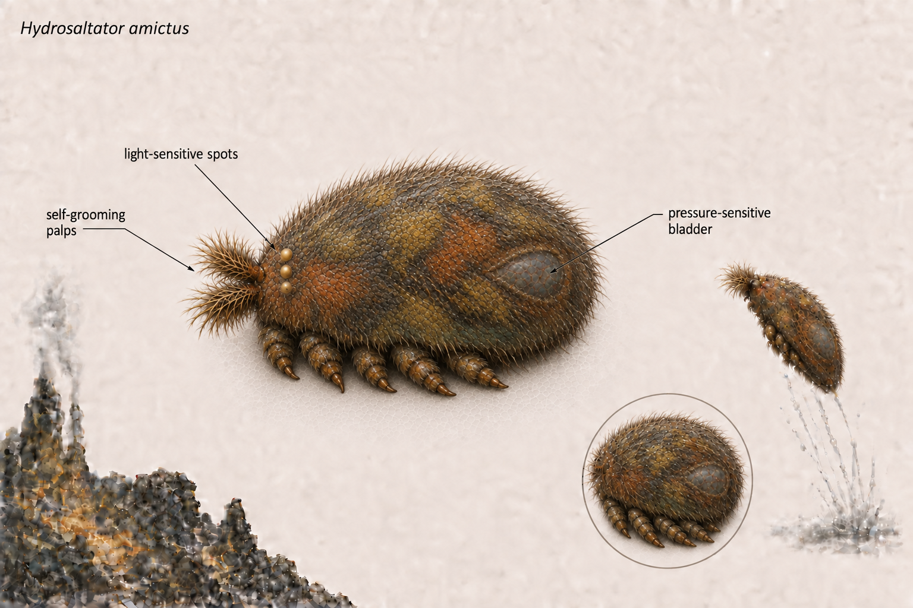

# Scientific Dossier: *Hydrosaltator amictus*

## Profile
- **Scientific Name:** Hydrosaltator amictus
- **Common Names:** Volcanic Spring Tick, Sulfur Spring Tick
- **Size:** 0.3mm
- **Cell Count:** 1400 cells

## Appearance and Locomotion

*Hydrosaltator amictus* has a short, broad oval body wrapped around a pressure-sensitive inner bladder. Its surface carries charcoal, rusty orange, sulfur-yellow, olive, and muted teal biofilm tones typical of vent slime, punctuated by a few luminous speckles. Longer articulated legs fold from the underside for scuttling and hydraulic leaps. The head carries furry, mustache-like palps and three visible light-sensitive spots; the palps sweep the face and shell as sensory feelers and enthusiastic self-grooming mechanisms.

- **Body:** Soft, luminous, and compactly oval with a dense fuzzy coat
- **Coloration:** Charcoal, rusty orange, sulfur yellow, olive, and muted teal vent-slime tones
- **Legs:** Long articulated limbs tucked beneath the body for scuttling and hydraulic leaping
- **Head:** Furry mustache-like palps plus three light-sensitive spots for low-light orientation
- **Grooming system:** Palps comb mineral dust and sulfur residue from the face valves

## Environment & Limits
- **Depth Range:** Deep-sea hydrothermal vents (2,500m to 4,960m depth)
- **Active Range:** 50C to 85C
- **Tun State Trigger:** Below 40C
- **Wake Trigger:** Above 60C
- **Lethal Limit:** Above 110C

## Symbiotic Matrix Community
1. **Larger Matrix Host:** *Gelatinicollum vulcanum*
2. **Primary Harvester:** [*Sulfuribacillus thermophilus* (Emberspit Microbe)](Sulfuribacillus_thermophilus_Emberspit_Microbe.md)
3. **Secondary Refiner:** [*Saccharoplasma lentus* (Sugar-Silk Protist)](Saccharoplasma_lentus_Sugar_Silk_Protist.md)

These are the tick’s closest associates, within a wider food web whose members also exchange resources directly. Harvesters trade with refiners and mineral masons; gardeners receive sugar and dispersal services; grazers and viruses act on other microbes. The tick is one resident of this network.

## Social Reactions

When *Hydrosaltator amictus* encounters another colony or a fresh patch of matrix housing, it uses three documented social responses:

- **Ignore:** Low-value neighbors are passed without signal exchange; the colony saves its attention for hotter chemistry.
- **Mate:** Compatible colonies braid valve filaments and trade shell-building cells for one vent cycle.
- **Rob Matrix Housing:** If the host matrix is under-defended, the colony peels away a section of *Gelatinicollum vulcanum* and relocates it. In field notes, this is described as interior decorating with extremely poor manners.

## Chemical Nozzle Configurations
### Conical Pre-Wash
- Hyper-Saline Brine: 65%
- Liquid Sulfur Solvent: 20%
- Active Acid: 14%
- Dissolved H2S Gas: 1%

### Aerosolizing Blast Vent
- Hyper-Saline Brine: 75%
- Active Acid: 15%
- Liquid Sulfur Solvent: 8%
- Dissolved H2S Gas: 2%

*The expanded behavior and anatomy below are speculative worldbuilding for this fictional organism.*

## Detailed behavior

Hydrosaltator alternates between slow surface patrols and brief hydraulic leaps. During a patrol, the palps sweep ahead of the feet to sample gel, clear grit from the face valves, and locate productive harvester pockets. It pauses to distribute symbiont products through the matrix, then follows stable chemical gradients and the Lantern Veil's signals toward the next feeding site.

A disturbance prompts the legs to brace before the pressure system drives a leap. After landing, the animal checks its footing and grooms exposed valves before resuming exchange with its companions. Neighbor encounters follow the established ignore, mate, or rob-matrix responses; theft involves gripping a loose sheet and relocating it in successive pulls. Below 40C it retracts its appendages and enters the tun state. Warming above 60C triggers gradual reopening, with sensory activity returning before full locomotion.

## Detailed anatomy

**Body wall and coat.** The 0.3 mm body is a compact, broad oval with a flexible regenerative outer shell. Dense fine projections hold a thin film of surrounding matrix and symbionts, producing the fuzzy outline and mottled charcoal, orange, yellow, olive, and teal surface. Sparse luminous speckles interrupt this coating. Flexible ventral folds let the limbs withdraw without tearing the shell.

**Head and sensory apparatus.** Paired mustache-like palps carry numerous fine contact hairs. Their flexible bases sweep a broad arc across the face, bringing trapped grit away from the valve openings. Three light-sensitive spots provide coarse orientation rather than detailed vision. A small fixed brain integrates these inputs with limb contact and pressure signals.

**Hydraulic locomotor system.** A pressure-sensitive inner bladder occupies much of the central body. Supporting bands constrain its expansion, while valves direct working fluid toward the articulated limbs. Long legs fold beneath the body at rest; flexible joints and gripping tips provide leverage during scuttling and a stable brace before a leap. Controlled release of pressure allows the limbs to fold again.

**Exchange and nozzle structures.** Sheltered surface pockets bring feeding tissues into contact with the symbiotic matrix. Separate face-valve passages guide the established chemical mixtures toward the conical pre-wash and blast-vent outlets. Reinforced outlet rims resist abrasion, while nearby grooming hairs keep deposits from obstructing them.

**Cell allocation and tun form.** The established 1,400-cell body is partially eutelic: brain and valve components retain a fixed organization while the outer shell can regenerate. In the tun, the bladder relaxes, limbs and palps tuck inward, and the body wall closes over vulnerable openings, leaving a compact protected form.

## Relationships in the wider food web

The following direct links appear in the [illustrated community food web](hydrosalt-cryptids/README.md). Exchange arrows run from provider to recipient; predation, parasitism, and infection run from attacker to target.

| Edge | From | To | Interaction |
| --- | --- | --- | --- |
| E16 | *Palpophaga pilosa* | *Hydrosaltator amictus* | Palp grazing (parasitism) |
| E20 | *Hydrosaltator amictus* | *Aerosporia leaperi* | Launch turbulence (transport) |
