# AI-Generated Microbes

This repository contains speculative, AI-generated organism profiles and supporting reference material.

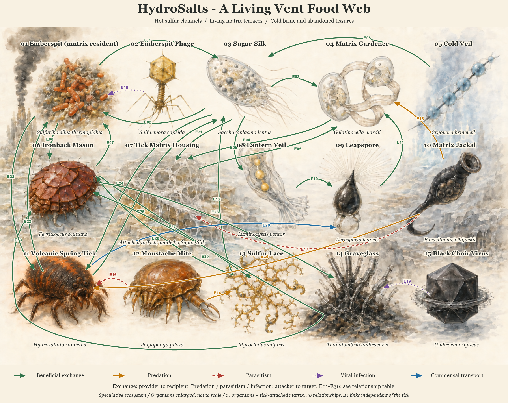

## Featured organism: *Hydrosaltator amictus*

*Hydrosaltator amictus*, also called the Volcanic Spring Tick or Sulfur Spring Tick, is about 0.8 mm long and has approximately 4,000 cells: 1,400 fixed core cells and about 2,600 regenerative shell and support cells. It is adapted to hydrothermal vents at 2,500-4,960 m depth. It has a compact oval fuzzy, glowing body, articulated legs for scuttling and hydraulic leaping, and furry mustache-like palps for sensing and self-grooming. Its normal jump covers about 30 mm (3 cm), or 37.5 body lengths. Its active range is 50-85 degrees C, with a tun (cryptobiotic) state below 40 degrees C and a lethal limit above 110 degrees C.

The organism is described as partially eutelic, with a fixed brain and valves plus a regenerative outer shell. Its proposed symbiotic ecosystem is a three-way symbiosis between the tick, *Sulfuribacillus thermophilus* (Emberspit Microbe), and *Saccharoplasma lentus* (Sugar-Silk Protist). Sugar-Silk creates the matrix housing; the matrix is not a species.

Its documented social reactions are **ignore**, **mate**, and **rob matrix housing** - the last involving the theft and relocation of Sugar-Silk-produced matrix gel.

## HydroSalts reference files

- [Scientific dossier](Hydrosaltator_amictus_Dossier.md) - profile, habitat, symbiosis, and nozzle configurations
- [Structured data](Hydrosaltator_amictus_Data.json) - machine-readable organism record
- [Spreadsheet data](Hydrosaltator_amictus_Spreadsheet.csv) - tabular reference export
- [Presentation](Hydrosaltator_amictus_Presentation.pptx) - visual overview
- [Theo's microscope research presentation](<Theo%E2%80%99s%20Microscope%20Research.pptx>)
- [Core statistics PDF](Hydrosaltator_amictus_Core_Statistics.pdf)
- [Scientific diagram](Hydrosaltator_amictus_Scientific_Diagram.png)
- [Archaea harvester: *Sulfuribacillus thermophilus*](Sulfuribacillus_thermophilus_Emberspit_Microbe.md)
- [Protocist refiner: *Saccharoplasma lentus*](Saccharoplasma_lentus_Sugar_Silk_Protist.md)

## Notes

The dossier, JSON, and CSV provide the easiest formats for reading or reusing the data.

## HydroSalts symbiotic community

The illustrated vent food web connects **14 organisms and the tick-attached matrix housing through 30 direct relationships**, with **24 links independent of the Volcanic Spring Tick**. Colored arrows distinguish beneficial exchange, predation, parasitism, viral infection, and commensal transport. The [community overview and relationship table](hydrosalt-cryptids/README.md) explain every arrow, including exchanges among harvesters, refiners, repair cells, recyclers, and the cold-fissure community. The [Tick Matrix Housing profile](hydrosalt-cryptids/gelatinicollum_vulcanum.md) describes the extracellular habitat created by Sugar-Silk.

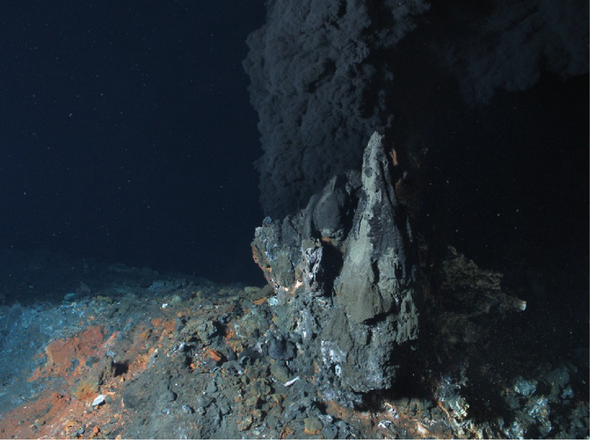

*Vent field reference photograph used alongside the speculative HydroSalts habitat illustration.*

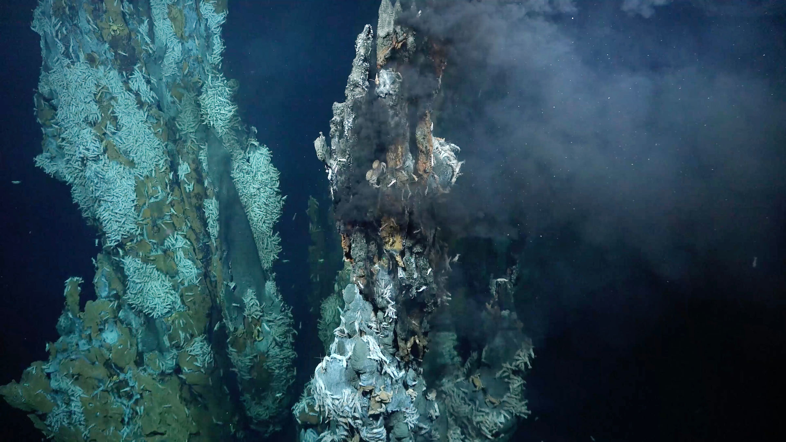

*Second vent field reference photograph from the Downloads set, showing the kind of habitat where the fictional HydroSalts community would live.*

| Illustration / cryptid | Type | Role |
| --- | --- | --- |
| [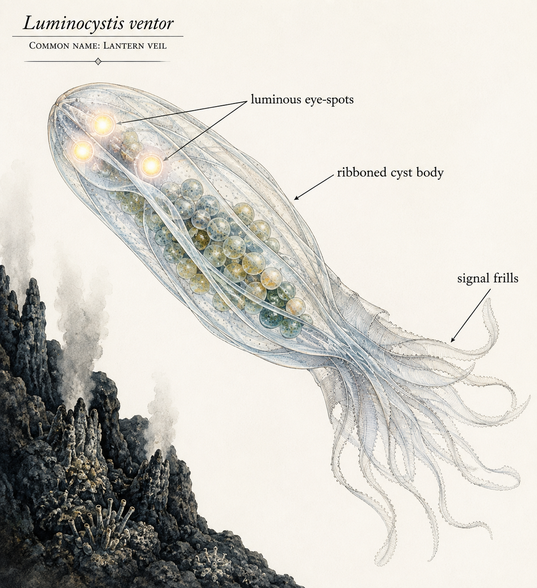](hydrosalt-cryptids/luminocystis_ventor.md) [*Luminocystis ventor*](hydrosalt-cryptids/luminocystis_ventor.md) | Mutualist | Bioluminescent signaler |
| [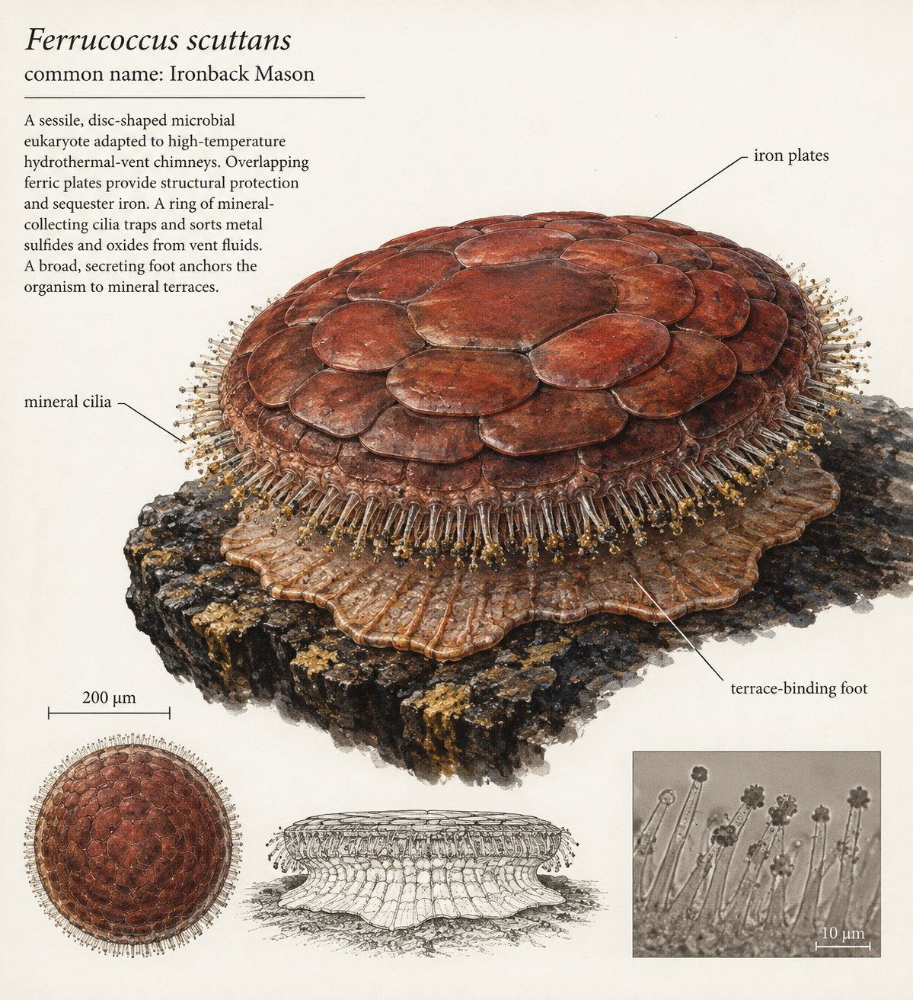](hydrosalt-cryptids/ferrucoccus_scuttans.md) [*Ferrucoccus scuttans*](hydrosalt-cryptids/ferrucoccus_scuttans.md) | Mutualist | Mineral mason |
| [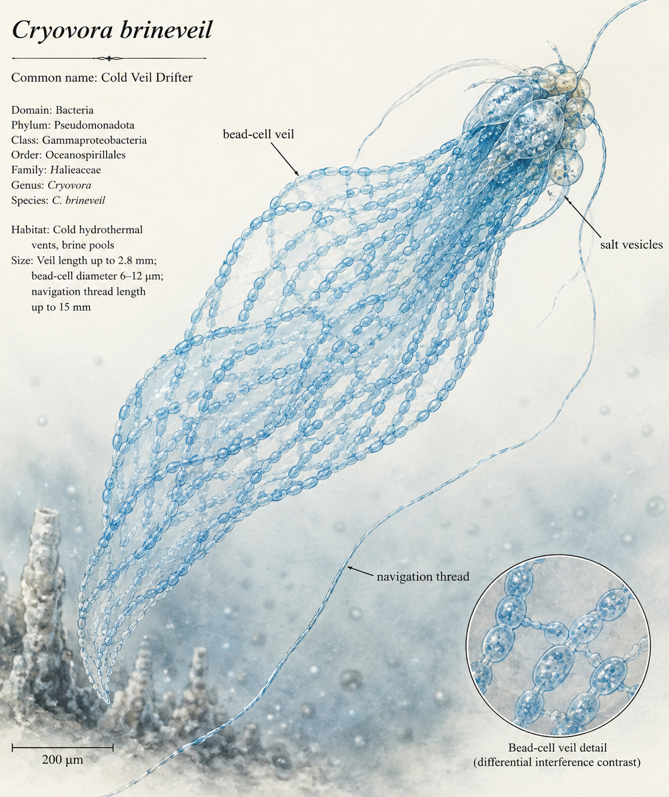](hydrosalt-cryptids/cryovora_brineveil.md) [*Cryovora brineveil*](hydrosalt-cryptids/cryovora_brineveil.md) | Commensal | Brine-current navigator |
| [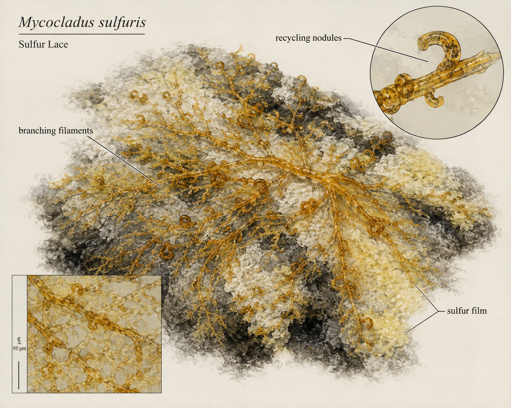](hydrosalt-cryptids/mycocladus_sulfuris.md) [*Mycocladus sulfuris*](hydrosalt-cryptids/mycocladus_sulfuris.md) | Decomposer | Sulfur-film recycler |
|  [*Parasitovibrio hijackii*](hydrosalt-cryptids/parasitovibrio_hijackii.md) | Parasite | Matrix-housing thief |
| [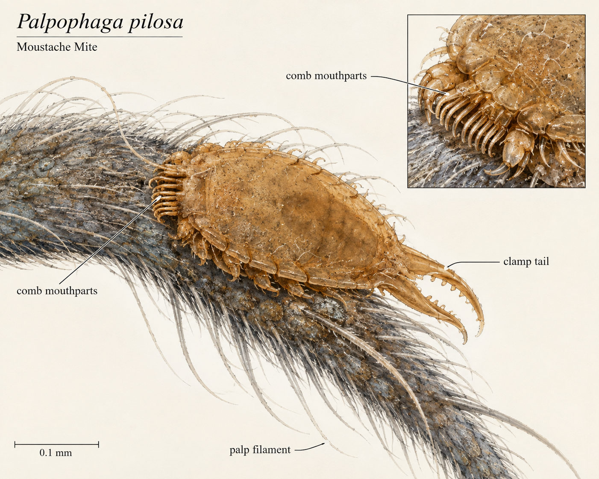](hydrosalt-cryptids/palpophaga_pilosa.md) [*Palpophaga pilosa*](hydrosalt-cryptids/palpophaga_pilosa.md) | Ectoparasite | Palp grazer |
| [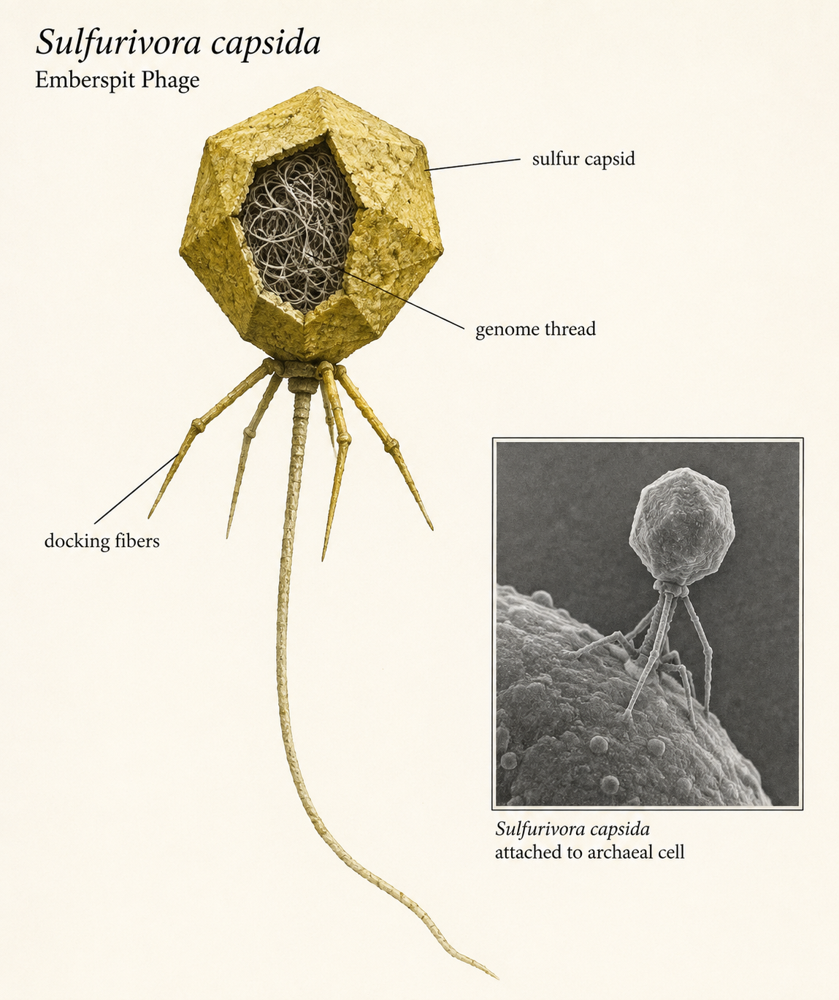](hydrosalt-cryptids/sulfurivora_capsida.md) [*Sulfurivora capsida*](hydrosalt-cryptids/sulfurivora_capsida.md) | Virus | Archaea parasite |
| [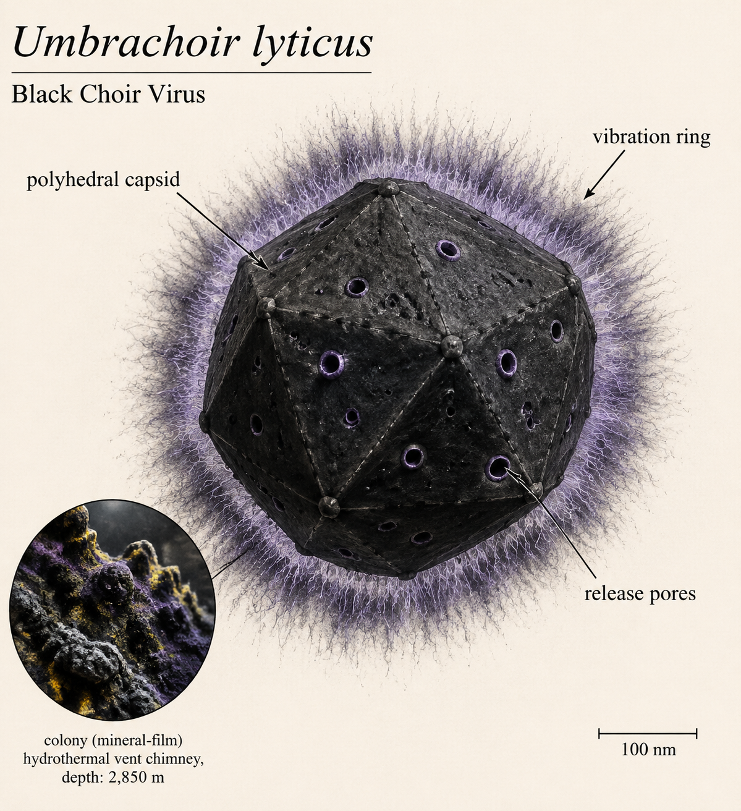](hydrosalt-cryptids/umbrachoir_lyticus.md) [*Umbrachoir lyticus*](hydrosalt-cryptids/umbrachoir_lyticus.md) | Virus | Colony rhythm parasite |
|  [*Gelatinocella wardii*](hydrosalt-cryptids/gelatinocella_wardii.md) | Mutualist | Matrix stabilizer |
| [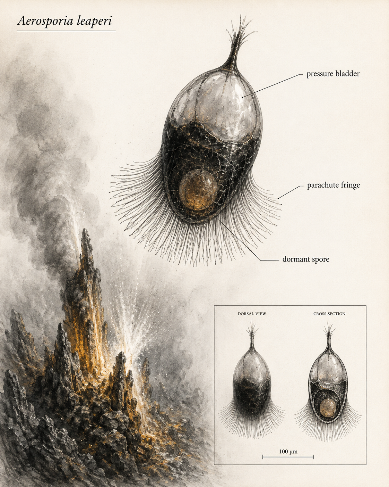](hydrosalt-cryptids/aerosporia_leaperi.md) [*Aerosporia leaperi*](hydrosalt-cryptids/aerosporia_leaperi.md) | Dispersal mutualist | Spore courier |

## Microscope image index

Each row pairs a shot with its species-named field-note description. Images are kept compact so the table remains easy to scan.

| Shot | Description |
| --- | --- |
|  Codex Image Aug 30, 2026, 05_06_00 PM.jpg | [*Speculomyces umbraticus* field note](image-notes/Speculomyces_umbraticus_Codex_Image_Aug_30_2026_05_06_00_PM.md) - annotated fly head and mouthparts |
|  Codex Image Aug 30, 2026, 05_06_59 PM.jpg | [*Speculomyces bristletailis* field note](image-notes/Speculomyces_bristletailis_Codex_Image_Aug_30_2026_05_06_59_PM.md) - annotated fly head and mouthparts |
|  Codex Image Aug 30, 2026, 05_07_05 PM.jpg | [*Speculomyces cellulovorus* field note](image-notes/Speculomyces_cellulovorus_Codex_Image_Aug_30_2026_05_07_05_PM.md) - annotated fly abdomen and terminalia |
|  S20260523_0001.jpg | [*Speculomyces velutinus* field note](image-notes/Speculomyces_velutinus_S20260523_0001.md) - plant epidermal cells |
|  S20260523_0004.jpg | [*Speculomyces rubriventris* field note](image-notes/Speculomyces_rubriventris_S20260523_0004.md) - plant epidermal cells |
|  S20260523_0006.jpg | [*Speculomyces glimmeri* field note](image-notes/Speculomyces_glimmeri_S20260523_0006.md) - plant epidermal cells |
|  S20260523_0007.jpg | [*Speculomyces pavimentalis* field note](image-notes/Speculomyces_pavimentalis_S20260523_0007.md) - plant vascular cross-section |
|  S20260523_0008.jpg | [*Speculomyces umbraticus* field note](image-notes/Speculomyces_umbraticus_S20260523_0008.md) - hair or setal field |
|  S20260523_0009.jpg | [*Speculomyces bristletailis* field note](image-notes/Speculomyces_bristletailis_S20260523_0009.md) - plant epidermal cells |
|  S20260523_0010.jpg | [*Speculomyces cellulovorus* field note](image-notes/Speculomyces_cellulovorus_S20260523_0010.md) - plant epidermal cells |
|  S20260523_0011.jpg | [*Speculomyces velutinus* field note](image-notes/Speculomyces_velutinus_S20260523_0011.md) - plant epidermal cells |
|  S20260523_0012.jpg | [*Speculomyces rubriventris* field note](image-notes/Speculomyces_rubriventris_S20260523_0012.md) - plant vascular cross-section |
|  S20260523_0013.jpg | [*Speculomyces glimmeri* field note](image-notes/Speculomyces_glimmeri_S20260523_0013.md) - plant epidermal cells |
|  S20260523_0014.jpg | [*Speculomyces pavimentalis* field note](image-notes/Speculomyces_pavimentalis_S20260523_0014.md) - plant epidermal cells |
|  S20260523_0015.jpg | [*Speculomyces umbraticus* field note](image-notes/Speculomyces_umbraticus_S20260523_0015.md) - hair or setal field |
|  S20260523_0016.jpg | [*Speculomyces bristletailis* field note](image-notes/Speculomyces_bristletailis_S20260523_0016.md) - hair or setal field |
|  S20260523_0017.jpg | [*Speculomyces cellulovorus* field note](image-notes/Speculomyces_cellulovorus_S20260523_0017.md) - arthropod body fragment |
|  S20260523_0018.jpg | [*Speculomyces velutinus* field note](image-notes/Speculomyces_velutinus_S20260523_0018.md) - diffuse translucent field |
|  S20260523_0019.jpg | [*Speculomyces rubriventris* field note](image-notes/Speculomyces_rubriventris_S20260523_0019.md) - diffuse translucent field |
|  S20260523_0020.jpg | [*Speculomyces glimmeri* field note](image-notes/Speculomyces_glimmeri_S20260523_0020.md) - arthropod body fragment |
|  S20260523_0021.jpg | [*Speculomyces pavimentalis* field note](image-notes/Speculomyces_pavimentalis_S20260523_0021.md) - plant vascular cross-section |
|  S20260523_0022.jpg | [*Speculomyces umbraticus* field note](image-notes/Speculomyces_umbraticus_S20260523_0022.md) - plant epidermal cells |
|  S20260523_0023.jpg | [*Speculomyces bristletailis* field note](image-notes/Speculomyces_bristletailis_S20260523_0023.md) - stained round bodies |
|  S20260523_0024.jpg | [*Speculomyces cellulovorus* field note](image-notes/Speculomyces_cellulovorus_S20260523_0024.md) - plant vascular cross-section |
|  S20260523_0025.jpg | [*Speculomyces velutinus* field note](image-notes/Speculomyces_velutinus_S20260523_0025.md) - plant epidermal cells |
|  S20260523_0026.jpg | [*Speculomyces rubriventris* field note](image-notes/Speculomyces_rubriventris_S20260523_0026.md) - plant epidermal cells |
|  S20260523_0027.jpg | [*Speculomyces glimmeri* field note](image-notes/Speculomyces_glimmeri_S20260523_0027.md) - plant epidermal cells |
|  S20260523_0028.jpg | [*Speculomyces pavimentalis* field note](image-notes/Speculomyces_pavimentalis_S20260523_0028.md) - stained round bodies |
|  S20260523_0029.jpg | [*Speculomyces umbraticus* field note](image-notes/Speculomyces_umbraticus_S20260523_0029.md) - oval cellular bodies |
|  S20260523_0030.jpg | [*Speculomyces bristletailis* field note](image-notes/Speculomyces_bristletailis_S20260523_0030.md) - stained round bodies |
|  S20260523_0031.jpg | [*Speculomyces cellulovorus* field note](image-notes/Speculomyces_cellulovorus_S20260523_0031.md) - plant vascular cross-section |
|  S20260523_0032.jpg | [*Speculomyces velutinus* field note](image-notes/Speculomyces_velutinus_S20260523_0032.md) - plant vascular cross-section |
|  S20260523_0033.jpg | [*Speculomyces rubriventris* field note](image-notes/Speculomyces_rubriventris_S20260523_0033.md) - stoma and guard-cell aperture |
|  S20260523_0034.jpg | [*Speculomyces glimmeri* field note](image-notes/Speculomyces_glimmeri_S20260523_0034.md) - botanical vascular cross-section |
|  S20260523_0035.jpg | [*Speculomyces pavimentalis* field note](image-notes/Speculomyces_pavimentalis_S20260523_0035.md) - botanical vascular cross-section |
|  S20260523_0036.jpg | [*Speculomyces umbraticus* field note](image-notes/Speculomyces_umbraticus_S20260523_0036.md) - botanical vascular cross-section |
|  S20260523_0037.jpg | [*Speculomyces bristletailis* field note](image-notes/Speculomyces_bristletailis_S20260523_0037.md) - botanical vascular cross-section |
|  S20260523_0038.jpg | [*Speculomyces cellulovorus* field note](image-notes/Speculomyces_cellulovorus_S20260523_0038.md) - botanical vascular cross-section |
|  S20260523_0039.jpg | [*Speculomyces velutinus* field note](image-notes/Speculomyces_velutinus_S20260523_0039.md) - diffuse translucent field |
|  S20260524_0001.jpg | [*Speculomyces rubriventris* field note](image-notes/Speculomyces_rubriventris_S20260524_0001.md) - stoma and guard-cell aperture |
|  S20260524_0002.jpg | [*Speculomyces glimmeri* field note](image-notes/Speculomyces_glimmeri_S20260524_0002.md) - translucent cellular field |
|  S20260524_0003.jpg | [*Speculomyces pavimentalis* field note](image-notes/Speculomyces_pavimentalis_S20260524_0003.md) - translucent cellular field |
|  S20260524_0004.jpg | [*Speculomyces umbraticus* field note](image-notes/Speculomyces_umbraticus_S20260524_0004.md) - granular tissue or colony field |
|  S20260524_0005.jpg | [*Speculomyces bristletailis* field note](image-notes/Speculomyces_bristletailis_S20260524_0005.md) - granular tissue or colony field |
|  S20260524_0006.jpg | [*Speculomyces cellulovorus* field note](image-notes/Speculomyces_cellulovorus_S20260524_0006.md) - granular tissue or colony field |
|  S20260524_0007.jpg | [*Speculomyces velutinus* field note](image-notes/Speculomyces_velutinus_S20260524_0007.md) - granular tissue or colony field |
|  S20260524_0008.jpg | [*Speculomyces rubriventris* field note](image-notes/Speculomyces_rubriventris_S20260524_0008.md) - granular tissue or colony field |
|  S20260524_0009.jpg | [*Speculomyces glimmeri* field note](image-notes/Speculomyces_glimmeri_S20260524_0009.md) - granular tissue or colony field |
|  S20260524_0010.jpg | [*Speculomyces pavimentalis* field note](image-notes/Speculomyces_pavimentalis_S20260524_0010.md) - granular tissue or colony field |
|  S20260524_0011.jpg | [*Speculomyces umbraticus* field note](image-notes/Speculomyces_umbraticus_S20260524_0011.md) - granular tissue or colony field |
|  S20260830_0001.jpg | [*Speculomyces bristletailis* field note](image-notes/Speculomyces_bristletailis_S20260830_0001.md) - turquoise plant epidermis |
|  S20260830_0002.jpg | [*Speculomyces cellulovorus* field note](image-notes/Speculomyces_cellulovorus_S20260830_0002.md) - turquoise plant epidermis |
|  S20260830_0003.jpg | [*Speculomyces velutinus* field note](image-notes/Speculomyces_velutinus_S20260830_0003.md) - sparkling particulate field |
|  S20260830_0004.jpg | [*Speculomyces rubriventris* field note](image-notes/Speculomyces_rubriventris_S20260830_0004.md) - hair or setal field |
|  S20260830_0005.jpg | [*Speculomyces glimmeri* field note](image-notes/Speculomyces_glimmeri_S20260830_0005.md) - granular tissue or colony field |
|  S20260830_0006.jpg | [*Speculomyces pavimentalis* field note](image-notes/Speculomyces_pavimentalis_S20260830_0006.md) - arthropod claw or leg |
|  S20260830_0007.jpg | [*Speculomyces umbraticus* field note](image-notes/Speculomyces_umbraticus_S20260830_0007.md) - arthropod claw or leg |
|  S20260830_0008.jpg | [*Speculomyces bristletailis* field note](image-notes/Speculomyces_bristletailis_S20260830_0008.md) - arthropod body and setae |
|  S20260830_0009.jpg | [*Speculomyces cellulovorus* field note](image-notes/Speculomyces_cellulovorus_S20260830_0009.md) - granular tissue or colony field |
|  S20260830_0010.jpg | [*Speculomyces velutinus* field note](image-notes/Speculomyces_velutinus_S20260830_0010.md) - hair or setal field |
|  S20260830_0011.jpg | [*Speculomyces rubriventris* field note](image-notes/Speculomyces_rubriventris_S20260830_0011.md) - soft-focus filament field |
|  S20260830_0012.jpg | [*Speculomyces glimmeri* field note](image-notes/Speculomyces_glimmeri_S20260830_0012.md) - soft-focus filament field |
|  S20260830_0013.jpg | [*Speculomyces pavimentalis* field note](image-notes/Speculomyces_pavimentalis_S20260830_0013.md) - granular tissue or colony field |
|  S20260830_0014.jpg | [*Speculomyces umbraticus* field note](image-notes/Speculomyces_umbraticus_S20260830_0014.md) - granular tissue or colony field |
|  S20260830_0015.jpg | [*Speculomyces bristletailis* field note](image-notes/Speculomyces_bristletailis_S20260830_0015.md) - arthropod body |
|  S20260830_0016.jpg | [*Speculomyces cellulovorus* field note](image-notes/Speculomyces_cellulovorus_S20260830_0016.md) - false-color arthropod body |
|  S20260830_0017.jpg | [*Speculomyces velutinus* field note](image-notes/Speculomyces_velutinus_S20260830_0017.md) - arthropod body |

## Other AI-generated microbes

- [*Thanatovibrio umbracaris* dossier](Thanatovibrio_umbracaris_Dossier.md) - scary microbe profile
- [*Thanatovibrio umbracaris* structured data](Thanatovibrio_umbracaris_Data.json)
- [*Thanatovibrio umbracaris* spreadsheet](Thanatovibrio_umbracaris_Spreadsheet.csv)
