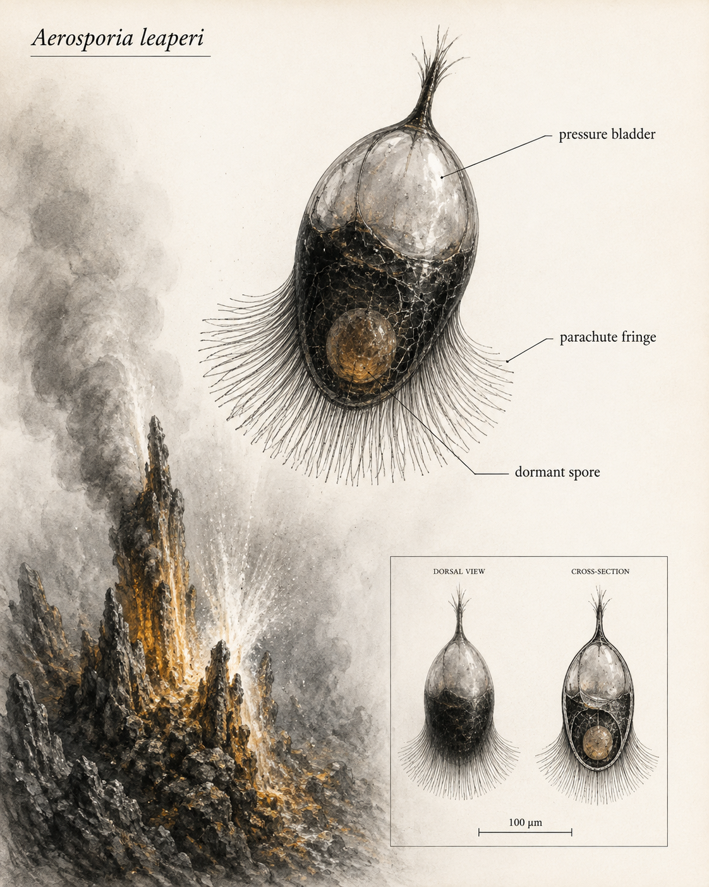

# Scientific Dossier: *Aerosporia leaperi*

**Common name:** Leapspore  
**Ecosystem role:** Chemical-gradient mutualist - Vent scout

## Profile

A dark teardrop spore with a parachute fringe and pressure bladder. This cryptid shares the same deep-sea hydrothermal-vent ecosystem as *Hydrosaltator amictus*.

- **Habitat:** the spray zone above active blast vents
- **Type:** Chemical-gradient mutualist
- **Role:** Vent-status scout and route guide

## Scientific illustration

## Symbiotic relationships

Tracks chemical gradients between terraces. It follows signals from the Lantern Veil and from Volcanic Spring Ticks, then helps the ticks locate productive vents.

## Field behavior

Launches toward stronger chemical gradients, lands badly, and calls both events intentional.

## Detailed behavior

Leapspore waits attached to a matrix terrace while its sensory surface samples sulfur compounds, heat, acidity, and dissolved minerals. When the local chemistry weakens, a pressure pulse from the vent or a Volcanic Spring Tick launch flexes its bladder and breaks the attachment. The fringe opens in the plume, increasing drag and carrying the scout toward a stronger chemical gradient.

On contact with gel, the fringe collapses and adhesive pads secure the spore. It compares the new chemistry with the old terrace before settling. Sulfur Spring Ticks can follow its route toward the stronger signal. If a vent is going extinct, the ticks enter a tun and release a distinctive cold, low-sulfur chemical signature; Leapspore detects that change, leaves the failing vent, and marks the route to a still-active vent. Its launches depend on surrounding water movement, with only limited control over the landing.

## Detailed anatomy

**Teardrop casing.** A dark, resistant wall encloses the dormant spore at the broad end of the body and tapers toward an attachment tip. Layered construction protects the core from abrasion while flexible seams accommodate pressure changes. Surface grooves channel water around the casing rather than through the sealed core.

**Pressure bladder.** A compliant chamber lies beside the spore compartment, separated from it by a supporting partition. In this deep-sea design, the chamber deforms with local pressure and fluid displacement; it is not an atmospheric balloon. Elastic recoil helps detach the courier when external turbulence supplies the launch force.

**Parachute fringe.** Radiating strands extend from a collar around the broad end. Thin membranes between neighboring strands form a collapsible drag surface. Reinforced strand bases bear the initial pull, and flexible tips fold on contact to reduce snagging at landing.

**Chemical sensing and settlement.** Fine pores along the outer wall sample sulfur compounds, temperature, acidity, and dissolved minerals. The pressure bladder supplies short relocation jumps, while the parachute fringe slows the landing. A protected seam and temporary attachment pads hold the casing against a new terrace once the chemistry is favorable.

## Diagnostic structures

- **pressure bladder**
- **parachute fringe**
- **dormant spore**

## Research note

This organism uses the HydroSalts template: anatomy, habitat, ecosystem role, and interactions are tracked together so the vent community reads as one system.

## Relationships in the wider food web

The following direct links appear in the [illustrated community food web](README.md). Exchange arrows run from provider to recipient; predation, parasitism, and infection run from attacker to target.

| Edge | From | To | Interaction |
| --- | --- | --- | --- |
| E10 | *Luminocystis ventor* | *Aerosporia leaperi* | Safe-route cues (benefit) |
| E11 | *Aerosporia leaperi* | *Hydrosaltator amictus* | Guides tick toward active chemistry (benefit) |
| E20 | *Hydrosaltator amictus* | *Aerosporia leaperi* | Tun-state chemical signal (benefit) |
