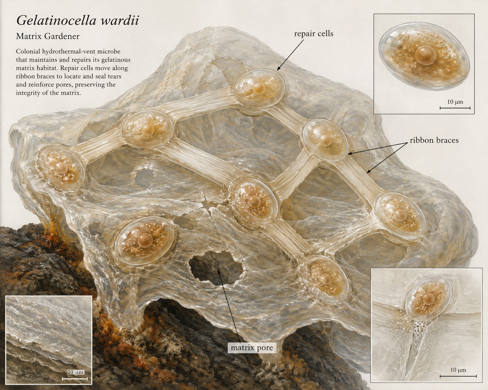

# Scientific Dossier: *Gelatinocella wardii*

**Common name:** Matrix Gardener  
**Ecosystem role:** Mutualist - Housing stabilizer

## Profile

A cluster of translucent oval cells linked by broad ribbon-like braces. This cryptid shares the same deep-sea hydrothermal-vent ecosystem as *Hydrosaltator amictus*.

- **Habitat:** inside the gelatinous matrix surrounding Hydrosaltator
- **Type:** Mutualist
- **Role:** Housing stabilizer

## Scientific illustration

## Symbiotic relationships

Repairs tears in Gelatinicollum vulcanum and shelters the host's young; receives sugars from Saccharoplasma.

## Field behavior

Patches structural damage with the calm confidence of a landlord who has seen everything.

## Diagnostic structures

- **repair cells**
- **ribbon braces**
- **matrix pore**

## Research note

This organism uses the HydroSalts template: anatomy, habitat, ecosystem role, and interactions are tracked together so the vent community reads as one system.
