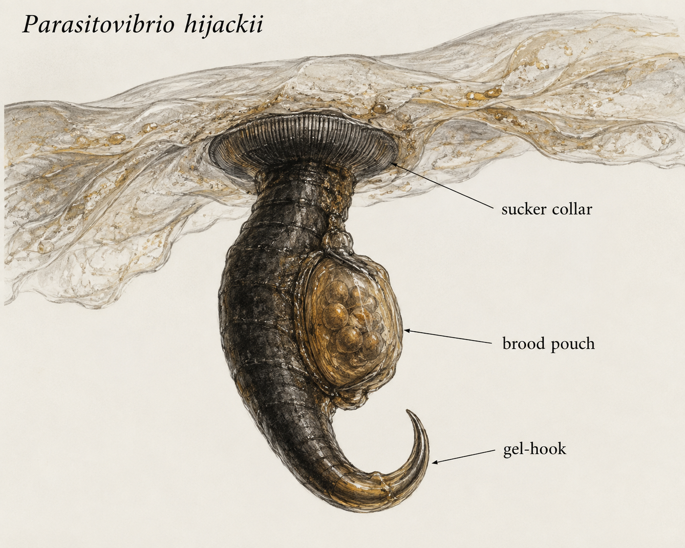

# Scientific Dossier: *Parasitovibrio hijackii*

**Common name:** Matrix Jackal  
**Ecosystem role:** Parasite - Matrix-housing thief

## Profile

A dark hooked rod with a sucker collar and a backpack-like brood pouch. This cryptid shares the same deep-sea hydrothermal-vent ecosystem as *Hydrosaltator amictus*.

- **Habitat:** the underside of Gelatinicollum vulcanum sheets
- **Type:** Parasite
- **Role:** Matrix-housing thief

## Scientific illustration

## Symbiotic relationships

Steals matrix gel from Hydrosaltator and weakens housing; scavengers feed on abandoned gel trails.

## Field behavior

Arrives after everyone else paid for construction and declares the lease invalid.

## Diagnostic structures

- **sucker collar**
- **gel-hook**
- **brood pouch**

## Research note

This organism uses the HydroSalts template: anatomy, habitat, ecosystem role, and interactions are tracked together so the vent community reads as one system.
