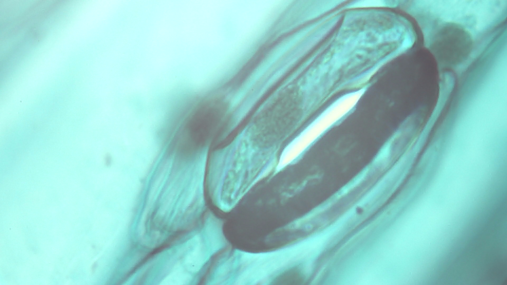

# Field note: S20260524_0001

## Specimen record

- **Source image:** S20260524_0001.jpg
- **Frame size:** 1920 x 1080 pixels
- **File size:** 658,166 bytes
- **Imaginary taxon:** *Speculomyces rubriventris*
- **Working class:** stoma and guard-cell aperture

## What the shot shows

A pore-like opening is bounded by paired guard cells in a sheet of plant tissue; blue-green illumination makes the aperture look architectural. This JPEG is part of the repository Single Shots collection, so color and contrast are recorded evidence while biological identity remains uncertain.

## Fictional habitat and ecosystem

In the imaginary field guide, this specimen occupies a compost-warm forest hollow. It shares the microhabitat with mineral-feeding filmers, threadlike decomposers, and one judgmental springtail. Nearby cells exchange nutrients through brief electrical pulses called **polite osmosis**, because they take turns asking first.

The ecosystem is small but busy: pigment cells provide shade, scavenger filaments recycle abandoned material, and a patient predator waits until everyone stops moving.

## Why it is interesting

This frame turns ordinary texture into a landscape. In the fictional interpretation, *Speculomyces rubriventris* is notable for treating cell walls as railway lines. It also uses one heroic flagellum as a coat rack.

## Researcher margin note

No real species identification should be inferred. The safest conclusion is that microscopy makes ordinary textures extraordinary and gives them excellent comedic timing.
