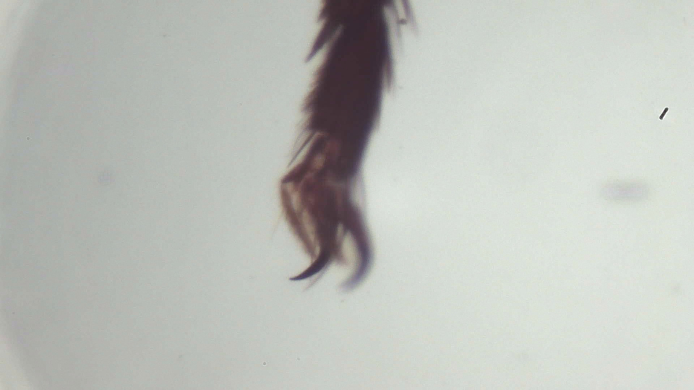

# Field note: S20260830_0006

> Fictional AI-generated interpretation of a microscope image. Visual observations are descriptive; the organism, habitat, and behavior are invented.

## Specimen record

- **Source image:** S20260830_0006.jpg
- **Frame size:** 1920 x 1080 pixels
- **File size:** 473,317 bytes
- **Imaginary taxon:** *Speculomyces pavimentalis*
- **Working class:** arthropod claw or leg

## What the shot shows

A dark tapered arthropod appendage or claw rises from the pale field, with a curved tip and fine surface hairs. This JPEG is part of the repository Single Shots collection, so color and contrast are recorded evidence while biological identity remains uncertain.

## Fictional habitat and ecosystem

In the imaginary field guide, this specimen occupies the damp underside of a fallen leaf. It shares the microhabitat with mineral-feeding filmers, threadlike decomposers, and one judgmental springtail. Nearby cells exchange nutrients through brief electrical pulses called **polite osmosis**, because they take turns asking first.

The ecosystem is small but busy: pigment cells provide shade, scavenger filaments recycle abandoned material, and a patient predator waits until everyone stops moving.

## Why it is interesting

This frame turns ordinary texture into a landscape. In the fictional interpretation, *Speculomyces pavimentalis* is notable for mistaking lint for royalty. It also treats the scale bar as a rival.

## Researcher margin note

No real species identification should be inferred. The safest conclusion is that microscopy makes ordinary textures extraordinary and gives them excellent comedic timing.

