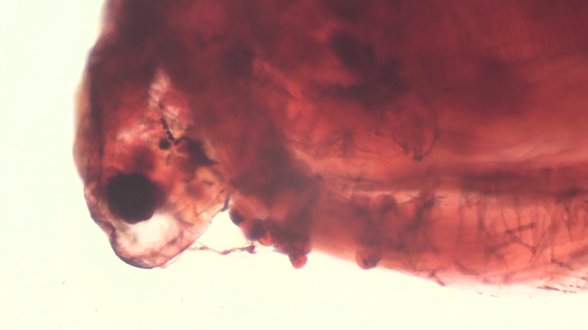

# Field note: S20260523_0016

## Specimen record

- **Source image:** S20260523_0016.jpg
- **Frame size:** 1920 x 1080 pixels
- **File size:** 376,001 bytes
- **Taxon:** *Speculomyces bristletailis*
- **Working class:** hair or setal field

## What the shot shows

Long fine fibers or bristles cross the frame, some bundled and some isolated, making a microscopic rope bridge. This JPEG is part of the repository Single Shots collection, so color and contrast are recorded evidence while biological identity remains uncertain.

## Habitat and ecosystem

In the field guide, this specimen occupies a compost-warm forest hollow. It shares the microhabitat with mineral-feeding filmers, threadlike decomposers, and one judgmental springtail. Nearby cells exchange nutrients through brief electrical pulses called **polite osmosis**, because they take turns asking first.

The ecosystem is small but busy: pigment cells provide shade, scavenger filaments recycle abandoned material, and a patient predator waits until everyone stops moving.

## Fictional biology

The following species-level behavior and anatomy are imagined field-guide lore shared across this taxon's entries; they are not observations or identifications from this photograph.

## Detailed behavior

Bristletailis advances through the fictional water film with its sensory bristle extended behind and to one side. Contact makes the bristle bend, prompting the cell to stop, turn, or flatten before pushing farther into a crevice. Repeated gentle contact produces shorter pauses; a sharp disturbance causes immediate withdrawal and partial bristle retraction.

The organism collects fine detritus in sheltered grooves and exchanges nutrient cues with neighboring cells before feeding in a crowded patch. New bristles develop during growth and after damage, supplying the biological premise for the one-more-slide joke. When conditions deteriorate, individuals pull together into loose resting groups, their bristles projecting outward until the final protective coating forms.

## Detailed anatomy

**Main cell body.** The imagined organism has a flexible spindle-shaped body with a broad feeding flank and a narrower trailing pole. Its membrane lies beneath a lightly reinforced pellicle. Longitudinal supporting strands preserve this polarity while allowing the cell to bend through narrow spaces.

**Sensory bristle.** A single prominent posterior bristle grows from a reinforced basal socket. Its stiff inner core transmits bending to a sensitive membrane collar at the base. The bristle primarily detects contact and flow; it is anatomically distinct from a beating locomotor flagellum.

**Feeding and attachment surfaces.** Short temporary lobes along the underside provide crawling traction. A shallow side depression concentrates suspended material into uptake vesicles. Secretion sites behind the depression lay down a thin adhesive film, letting the cell hold position while its bristle surveys the surrounding gap.

**Interior and regeneration.** The nucleus occupies the broad middle region, with digestive vacuoles toward the feeding flank and reserve droplets toward the rear. A cluster of structural-material vesicles near the bristle socket supports regrowth after breakage. Resting cells shorten the bristle and round up inside a thicker covering; the fictional bristle is not a claim about hairs visible in an unrelated specimen image.

## Why it is interesting

This frame turns ordinary texture into a landscape. In the interpretation, *Speculomyces bristletailis* is notable for growing a sensory bristle after the phrase one more slide. It also holds committee meetings at dawn.

## Researcher margin note

No real species identification should be inferred. The safest conclusion is that microscopy makes ordinary textures extraordinary and gives them excellent comedic timing.
