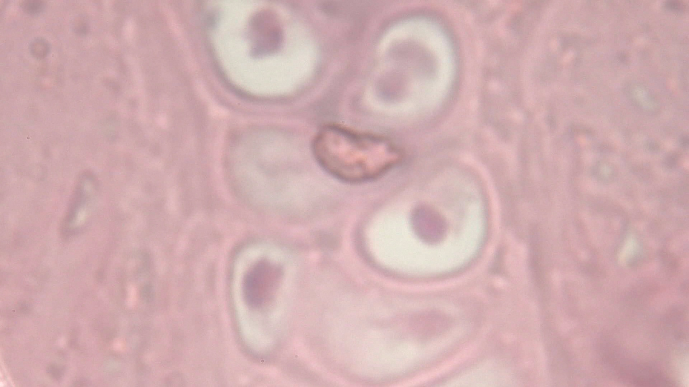

# Field note: S20260523_0037

## Specimen record

- **Source image:** S20260523_0037.jpg
- **Frame size:** 1920 x 1080 pixels
- **File size:** 585,581 bytes
- **Taxon:** *Speculomyces bristletailis*
- **Working class:** botanical vascular cross-section

## What the shot shows

Repeated pink or pale compartments gather around a denser central region, consistent with a section through a plant organ. This JPEG is part of the repository Single Shots collection, so color and contrast are recorded evidence while biological identity remains uncertain.

## Habitat and ecosystem

In the field guide, this specimen occupies a rain-dark greenhouse bench. It shares the microhabitat with mineral-feeding filmers, threadlike decomposers, and one judgmental springtail. Nearby cells exchange nutrients through brief electrical pulses called **polite osmosis**, because they take turns asking first.

The ecosystem is small but busy: pigment cells provide shade, scavenger filaments recycle abandoned material, and a patient predator waits until everyone stops moving.

## Why it is interesting

This frame turns ordinary texture into a landscape. In the interpretation, *Speculomyces bristletailis* is notable for growing a sensory bristle after the phrase one more slide. It also holds committee meetings at dawn.

## Researcher margin note

No real species identification should be inferred. The safest conclusion is that microscopy makes ordinary textures extraordinary and gives them excellent comedic timing.
