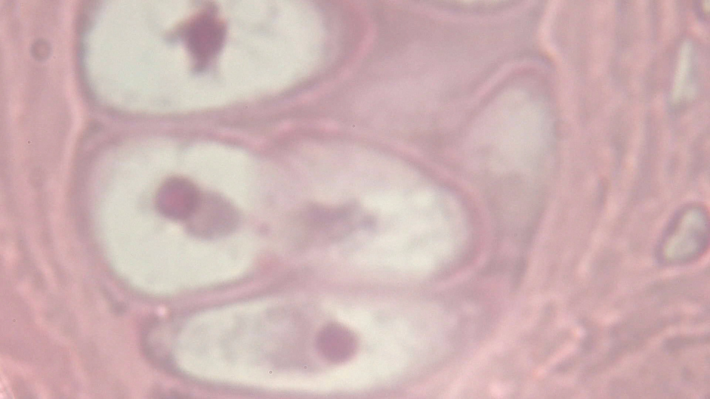

# Field note: S20260523_0038

## Specimen record

- **Source image:** S20260523_0038.jpg
- **Frame size:** 1920 x 1080 pixels
- **File size:** 574,728 bytes
- **Taxon:** *Speculomyces cellulovorus*
- **Working class:** botanical vascular cross-section

## What the shot shows

Repeated pink or pale compartments gather around a denser central region, consistent with a section through a plant organ. This JPEG is part of the repository Single Shots collection, so color and contrast are recorded evidence while biological identity remains uncertain.

## Habitat and ecosystem

In the field guide, this specimen occupies the damp underside of a fallen leaf. It shares the microhabitat with mineral-feeding filmers, threadlike decomposers, and one judgmental springtail. Nearby cells exchange nutrients through brief electrical pulses called **polite osmosis**, because they take turns asking first.

The ecosystem is small but busy: pigment cells provide shade, scavenger filaments recycle abandoned material, and a patient predator waits until everyone stops moving.

## Fictional biology

The following species-level behavior and anatomy are imagined field-guide lore shared across this taxon's entries; they are not observations or identifications from this photograph.

## Detailed behavior

Cellulovorus works along decomposing plant residue in the fictional habitat, softening exposed material and absorbing the resulting soluble food. Mineral grains caught during feeding are sorted into small deposits along the colony edge. Water movement against these deposits creates the tiny resonant bells of the field guide.

A passing shadow interrupts feeding: exposed lobes contract, contacts tighten, and the colony becomes still until the light returns to its previous level. Neighboring cells relay the disturbance through mechanical contact, producing a brief wave of withdrawal. As a patch is exhausted, fragments carrying reserves and a few mineral grains detach to establish another feeding front.

## Detailed anatomy

**Feeding body.** The fictional organism forms an irregular lobed cell or loose chain of connected cells. A flexible outer coat adheres to decaying plant surfaces, while broad ventral lobes increase contact with the material being processed. Enzyme-secreting sites and absorptive membrane patches are concentrated along this feeding face.

**Mineral bells.** Shallow exterior cups accumulate selected mineral grains in a secreted binder. Their thin rims and hollow centers provide the setting's resonant structures. The cups remain outside the living membrane and can break away without spilling the cell contents; they are neither internal skeletons nor auditory organs.

**Sensory and attachment regions.** Light-sensitive patches lie near the exposed cortex. Supporting fibers connect them mechanically to the lobe bases, where contraction reduces the exposed feeding area. Basal adhesive pads prevent a startled cell from being swept off its substrate.

**Digestive interior.** Digestive vacuoles carry absorbed material around a central nucleus, and reserve granules accumulate behind the active feeding front. Clear compartments regulate water balance. During fragmentation, each viable portion must retain living genetic material and reserves before sealing its new edge. These invented structures are separate from any actual plant walls or arthropod fragments shown in the photographs.

## Why it is interesting

This frame turns ordinary texture into a landscape. In the interpretation, *Speculomyces cellulovorus* is notable for turning mineral dust into resonant bells. It also believes every shadow is a predator.

## Researcher margin note

No real species identification should be inferred. The safest conclusion is that microscopy makes ordinary textures extraordinary and gives them excellent comedic timing.
