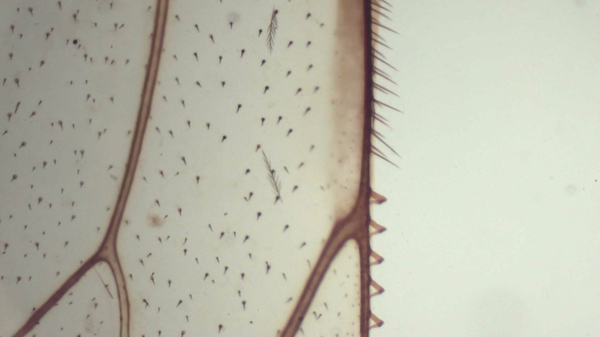

# Field note: S20260523_0007

## Specimen record

- **Source image:** S20260523_0007.jpg
- **Frame size:** 1920 x 1080 pixels
- **File size:** 509,220 bytes
- **Taxon:** *Speculomyces pavimentalis*
- **Working class:** plant vascular cross-section

## What the shot shows

Layered cell walls and a denser central bundle form a cross-sectional pattern, with small compartments radiating into larger pale regions. This JPEG is part of the repository Single Shots collection, so color and contrast are recorded evidence while biological identity remains uncertain.

## Habitat and ecosystem

In the field guide, this specimen occupies a rain-dark greenhouse bench. It shares the microhabitat with mineral-feeding filmers, threadlike decomposers, and one judgmental springtail. Nearby cells exchange nutrients through brief electrical pulses called **polite osmosis**, because they take turns asking first.

The ecosystem is small but busy: pigment cells provide shade, scavenger filaments recycle abandoned material, and a patient predator waits until everyone stops moving.

## Fictional biology

The following species-level behavior and anatomy are imagined field-guide lore shared across this taxon's entries; they are not observations or identifications from this photograph.

## Detailed behavior

Pavimentalis expands as a low fictional pavement colony, filling gaps before extending its outer boundary. Edge cells test neighboring surfaces through contact and chemical cues, then release adhesive material that holds the new margin in place. Food absorbed at the perimeter is shared inward through brief exchanges between adjacent cells.

Loose lint catches on the sticky margin and becomes a temporary scaffold, which explains the guide's unusually deferential treatment of passing fibers. Persistent contact with an obstacle redirects growth along its edge. When water recedes, peripheral cells detach into compact resting groups while the sheltered center remains anchored. The scale bar is a photographic annotation, so its supposed rivalry remains a field-note joke.

## Detailed anatomy

**Pavement organization.** The imagined colony is a mosaic of flattened polygonal cells whose close-fitting edges distribute mechanical stress. Each cell is enclosed by a flexible wall over its membrane. A thin shared surface coat seals small gaps while allowing the mosaic to bend across an uneven substrate.

**Intercellular seams.** Narrow seams contain adhesive material and short contact bridges. These keep neighboring cells aligned and permit local nutrient exchange. At the advancing edge, the seams are softer, allowing new cells to fit into spaces without breaking the mature central sheet.

**Basal attachment.** The underside bears broad adhesive pads separated by tiny water channels. The channels maintain access to dissolved resources beneath the colony. Short peripheral projections catch fibers and grit, giving the edge a less regular outline than the interior.

**Living contents and resting cells.** A flattened nucleus sits beside digestive vesicles and reserve inclusions in each compartment. A broad vacuole maintains cell volume and the slightly raised center of each tile. Resting cells round up, reduce their contact bridges, and thicken their coverings. The fictional mosaic is not evidence that photographed plant epidermis is this species.

## Why it is interesting

This frame turns ordinary texture into a landscape. In the interpretation, *Speculomyces pavimentalis* is notable for mistaking lint for royalty. It also treats the scale bar as a rival.

## Researcher margin note

No real species identification should be inferred. The safest conclusion is that microscopy makes ordinary textures extraordinary and gives them excellent comedic timing.
