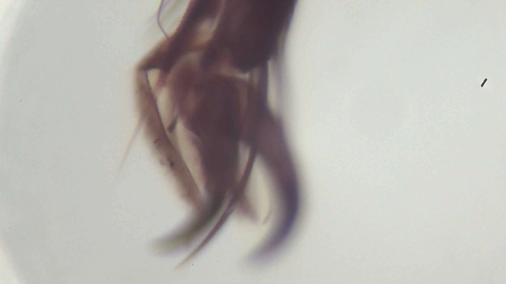

# Field note: S20260830_0007

## Specimen record

- **Source image:** S20260830_0007.jpg
- **Frame size:** 1920 x 1080 pixels
- **File size:** 481,108 bytes
- **Taxon:** *Speculomyces umbraticus*
- **Working class:** arthropod claw or leg

## What the shot shows

A dark tapered arthropod appendage or claw rises from the pale field, with a curved tip and fine surface hairs. This JPEG is part of the repository Single Shots collection, so color and contrast are recorded evidence while biological identity remains uncertain.

## Habitat and ecosystem

In the field guide, this specimen occupies a brackish tide-pool margin. It shares the microhabitat with mineral-feeding filmers, threadlike decomposers, and one judgmental springtail. Nearby cells exchange nutrients through brief electrical pulses called **polite osmosis**, because they take turns asking first.

The ecosystem is small but busy: pigment cells provide shade, scavenger filaments recycle abandoned material, and a patient predator waits until everyone stops moving.

## Fictional biology

The following species-level behavior and anatomy are imagined field-guide lore shared across this taxon's entries; they are not observations or identifications from this photograph.

## Detailed behavior

Umbraticus traces the margins of droplets in the fictional microhabitat, following moisture and dissolved scent cues. It leaves a faint adhesive trail whose chemical composition changes with recent feeding. Later contact with that trail alters its route, creating the field guide's impression that it remembers each nearby droplet.

The cell favors shaded recesses and slows when it meets a dry gap. If a water bridge forms, it extends across incrementally while keeping its rear anchored. Sudden illumination prompts withdrawal beneath debris. During scarcity, neighboring cells cluster around the last damp pocket and reduce movement, retaining separate bodies while sharing short exchanges of dissolved nutrients.

## Detailed anatomy

**Shadowed envelope.** The fictional cell has a soft lobed outline and a smoky outer pigment layer. A hydrated mucous sheath smooths the surface and holds chemical traces close to the body. Beneath it, a contractile cortex lets individual lobes extend or retract independently.

**Sensory perimeter.** Numerous small receptor patches line the leading lobes, sampling water chemistry and surface contact. Their uneven stimulation changes local tension and directs creeping. There is no permanent head or brain; the apparent memory rests on persistent cellular responses and the deposited chemical trail.

**Trail-producing structures.** Secretion vesicles accumulate toward the trailing surface and discharge through scattered membrane sites. The resulting film provides temporary traction and retains scent compounds. Basal contact patches release successively as the cell crosses a wet surface.

**Internal organization.** A nucleus remains within the thicker central body, surrounded by circulating cytoplasm, digestive vacuoles, and dark reserve granules. Clear water-regulating pockets expand near the margins. In the resting state the lobes collapse around the nucleus and reserves, while the sheath thickens into a protective capsule. Photographic shadows alone reveal none of these proposed systems.

## Why it is interesting

This frame turns ordinary texture into a landscape. In the interpretation, *Speculomyces umbraticus* is notable for remembering every nearby droplet. It also files its paperwork by scent.

## Researcher margin note

No real species identification should be inferred. The safest conclusion is that microscopy makes ordinary textures extraordinary and gives them excellent comedic timing.
